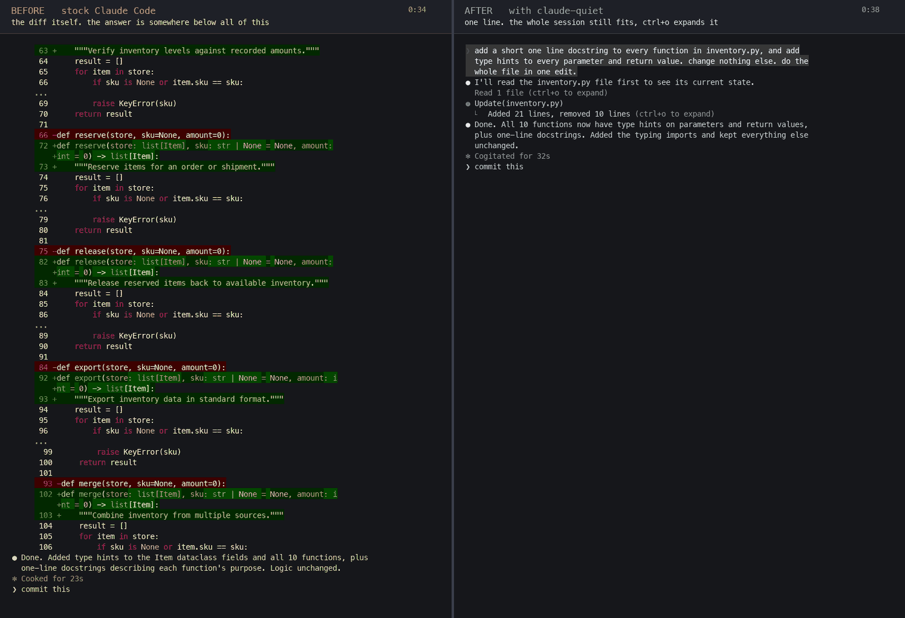
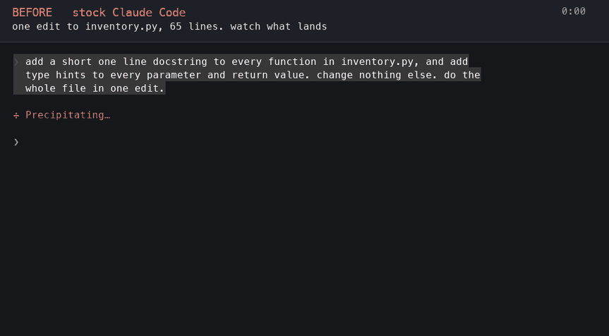
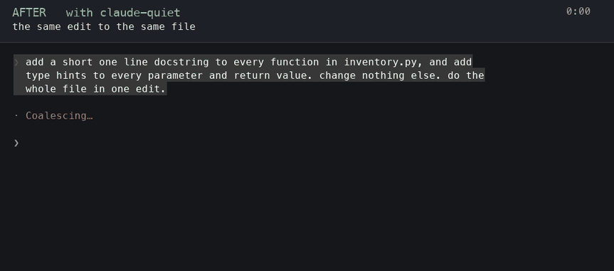
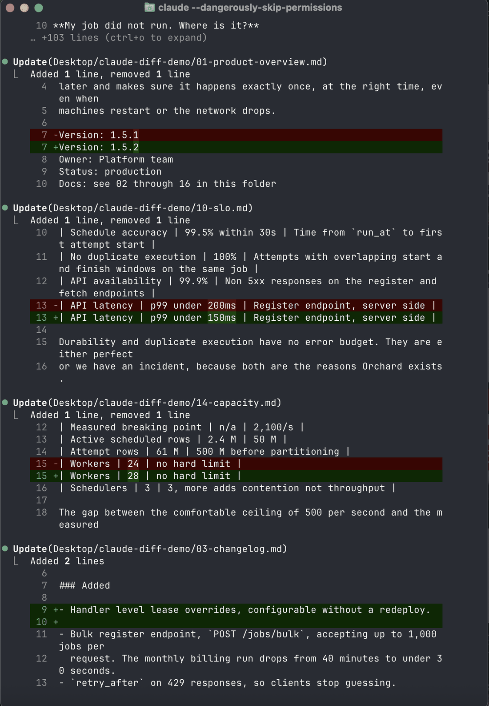

# claude-quiet

Claude Code prints every file edit in full. A 400 line edit puts 400 lines of
green on your screen. There is no setting to turn that off. This turns it into
one line per file, and `ctrl+o` still expands any of them.



**Left: stock Claude Code.** One edit to a 101 line file. Fifty three lines of
screen, almost all of it diff, and Claude's own answer is at the very bottom.
**Right: the same edit, patched.** Thirteen lines, the whole session still
readable: what you asked, what it read, `Added 21 lines, removed 10 lines`, and
the answer.

Same file, same instruction, same terminal. Both sides, as they actually ran:

**Before.** Stock Claude Code.



**After.** The same file, the same instruction, patched.



Real sessions on a real binary, captured frame by frame in the colours Claude
Code itself sends. Nothing mocked up or edited. The only addition is the caption
bar.

It is not only the big edits. Here are four edits that changed **one line each**,
on stock Claude Code:



Four one line changes, one full screen. Patched, that is four lines.

It works with whatever command you already use: `claude`, your own alias, a
wrapper script, an IDE integration. There is nothing new to remember.

---

## How this differs from `/focus`

Claude Code has a focus mode. It is a different thing.

| | `/focus` | claude-quiet |
|---|---|---|
| File diffs | hidden | **one line, expandable** |
| Which file was touched | hidden | shown |
| Tool names and output | hidden | shown |
| Claude's own text between tools | hidden | shown |
| Changes Claude's system prompt | yes, it stops narrating | no |
| Requires fullscreen mode | yes | no |

There is nothing between "print the entire file" and "show me nothing". That
gap is why this exists.

---

## Install

**macOS and Linux**, on the npm install of Claude Code. Windows is not
supported. Needs Python 3.9+ and Node.js.

There is no `curl | bash` here. You clone it, read it, and run it.

```bash
git clone https://github.com/nuuxcode/claude-quiet
cd claude-quiet
./install.sh
```

See exactly what it would do, without it doing anything:

```bash
./install.sh --dry-run
```

Then use `claude` exactly as you always have.

**Undo, completely, any time:**

```bash
claude-quiet restore
```

### What it installs

One pinned npm package, [tweakcc](https://github.com/Piebald-AI/tweakcc), into
`~/.claude-patch/tweakcc`. It is what opens the Claude Code executable and
closes it back up. Version and install call are in `lib/ccpatch.py`, near the
top, if you want to read them before running anything.

Nothing else is downloaded, then or ever, unless you run `claude-quiet update`.

### What it adds to your shell config

One line, so that the launcher is found before Claude Code itself:

```bash
export PATH="/path/to/claude-quiet/bin:$PATH"  # claude-quiet
```

Skip it with `--no-path` and put it wherever you prefer. Without it, a Claude
Code update quietly removes the change.

### About the signature

Editing the program invalidates the signature it shipped with, and macOS will
not run a program whose signature does not match its contents. So the edited
copy is signed locally instead.

That means the copy you run **is no longer signed by the original publisher**.
That is a real thing to give up, and you should decide it deliberately. The
original is kept untouched, and `claude-quiet restore` puts it back byte for byte.

### About Anthropic's terms

Claude Code is proprietary, and its terms restrict modifying the software. This
changes your own installed copy on your own machine, and it is reversible, but
it is a decision that is yours to make with your eyes open. Nothing here is
legal advice, and this project is not affiliated with Anthropic.

---

## What it actually does

Claude Code already knows how to show a short summary for a file edit. It just
reserves it for files under one of its own directories, so your project files
always print in full. This makes the short summary the behaviour for your files
too.

Nothing else changes: same summary, same `ctrl+o` to expand, same colours.

### Safety

- The change is applied to the copy of Claude Code on your machine. The
  original is saved first, and `restore` puts it back byte for byte.
- The patched program is built to one side and **run once** before it is
  allowed to replace the working one.
- If Claude Code changes in a way this does not recognise, it refuses and
  writes nothing rather than guessing.
- The launcher fails open. If anything goes wrong, Claude Code still starts,
  just unpatched.

### What it touches on your machine

```
~/.claude-patch/backups/     the untouched original (~250 MB, 2 kept)
~/.claude-patch/registry.json what is installed
your shell rc                one PATH line (skip it with --no-path)
```

The PATH entry is there because Claude Code updates itself, and an update
replaces the program and drops the change. The launcher notices and re-applies
it before starting, which takes about four seconds and only happens after an
update.

---

## Updating

```bash
claude-quiet update
```

It checks for a newer version, **shows you exactly what changed**, and asks
before applying anything. Say no and nothing happens.

**Nothing is ever downloaded or applied behind your back.** There is no
auto-update and no background fetching. The only time anything is fetched is
when you run the command above, and even then it applies nothing until you
agree.

The one thing that does happen by itself is repair: Claude Code replaces its
own program when it updates, which removes the change, so the next launch puts
back **exactly the code you already installed**.

If the code on disk has changed since you installed it, for any reason, it is
not applied on its own. You get told, and it waits:

```
claude-quiet     ON  v2.0.0
         update waiting: v2.0.0 installed, v2.1.0 on disk.
         review it, then run: claude-quiet install
```

Claude Code still starts normally in the meantime, with what you had before.

---

## Reference

```bash
claude-quiet status     is it on, and whether an update is waiting
claude-quiet update     check for a newer version, show it, ask before applying
claude-quiet install    turn it on (safe to run again)
claude-quiet restore    turn it off
claude-quiet verify     show the change, read from your own disk
claude-quiet doctor     check everything this needs
```

`ctrl+o` expands any collapsed diff, exactly as it always did.

---

### Uninstalling

```bash
claude-quiet restore
```

That puts the original program back, byte for byte, and takes this out of the
picture. Left behind afterwards:

```
~/.claude-patch/backups/     the saved original (~250 MB)
~/.claude-patch/registry.json
one line in your shell config
```

Remove those by hand if you want nothing left. They are kept by default because
throwing away someone's only copy of the original program is a bad default.

---

## Honest notes

**This modifies a program you did not build.** It is your copy, on your machine,
and it is reversible, but you should decide that deliberately. `--dry-run` and
`claude-quiet verify` exist so you never have to take a claim on trust.

**This repository contains no copy of Claude Code's source.**

**It will break on some Claude Code release.** It finds the code it changes by
shape, and shapes move. When that happens it refuses and writes nothing, so you
keep working on a normal, untouched Claude Code until the patterns are updated.
Refusing loudly is the designed behaviour, not a failure mode.

Not affiliated with Anthropic.

---

## Licence

MIT. See [LICENSE](LICENSE).
